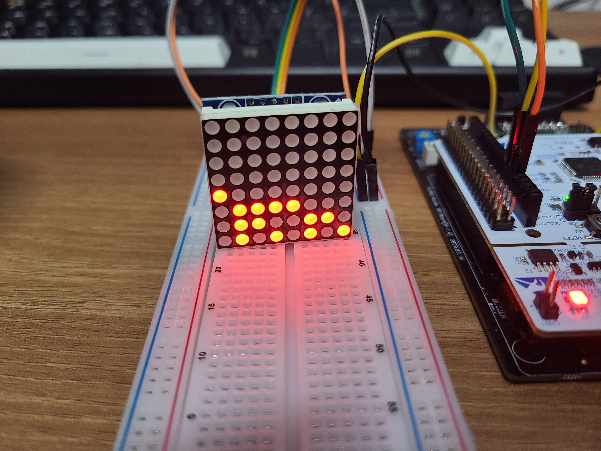
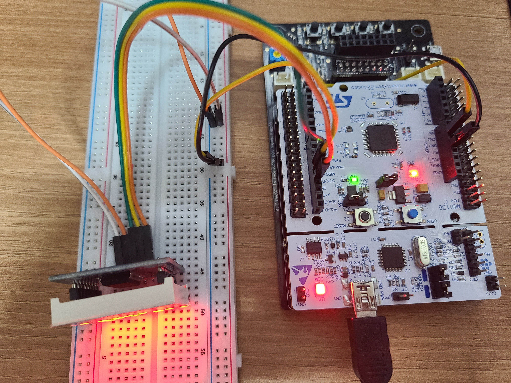

# 사용한 모듈

|모듈명|참고한 데이터시트|
|---|---|
|1088AS|[https://cdn.velleman.eu/downloads/29/infosheets/vmp502_led8x8_1088as.pdf](https://cdn.velleman.eu/downloads/29/infosheets/vmp502_led8x8_1088as.pdf)|
|MAX7219|[https://www.alldatasheet.co.kr/datasheet-pdf/view/73745/MAXIM/MAX7219.html](https://www.alldatasheet.co.kr/datasheet-pdf/view/73745/MAXIM/MAX7219.html)|

# 구현 사진

# 참고한 링크

[https://controllerstech.com/led-dot-matrix-and-stm32/](https://controllerstech.com/led-dot-matrix-and-stm32/)