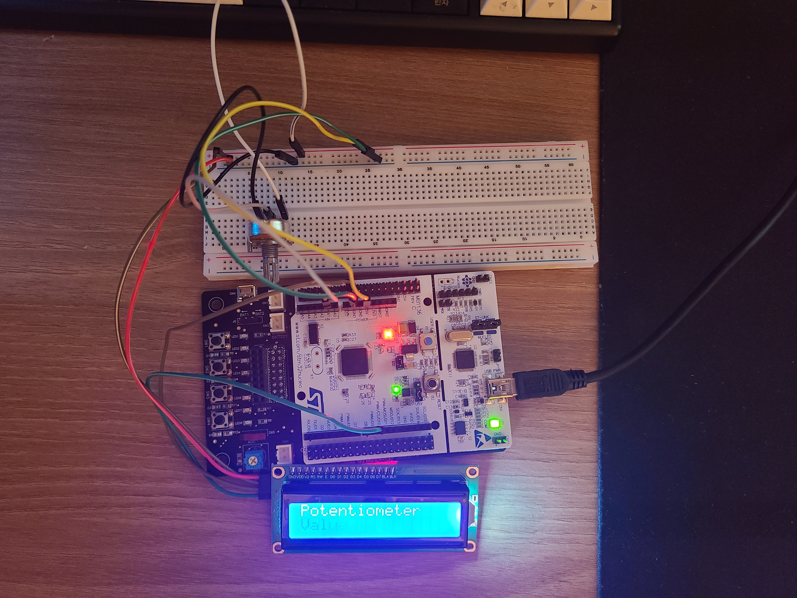

# 사용한 모듈

|모듈명|참고한 데이터시트|
|---|---|
|B10K Potentiometer|[https://www.mouser.com/datasheet/2/13/RV24AF-1658492.pdf](https://www.mouser.com/datasheet/2/13/RV24AF-1658492.pdf)|
|HD44780U|[https://cdn.sparkfun.com/assets/9/5/f/7/b/HD44780.pdf](https://cdn.sparkfun.com/assets/9/5/f/7/b/HD44780.pdf)|
|PCF8574|[https://www.ti.com/lit/ds/symlink/pcf8574.pdf](https://www.ti.com/lit/ds/symlink/pcf8574.pdf)|

# 구현 사진

